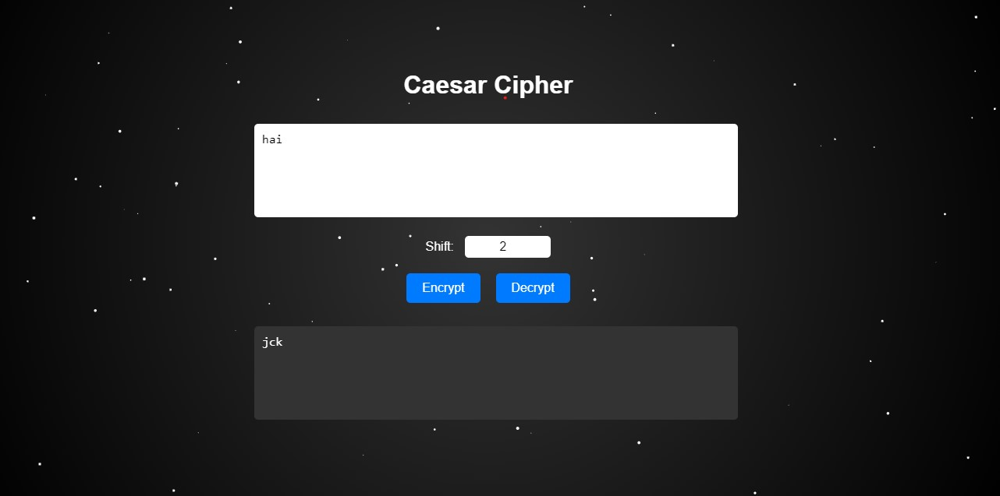

# Caesar_Cipher

This is a simple Caesar Cipher web application that allows users to encrypt and decrypt messages using the Caesar Cipher algorithm. It features a starry background effect, making the user interface visually appealing.

## Features
- **Encrypt and Decrypt Text**: Users can enter a text, specify a shift value, and encrypt or decrypt the text using the Caesar Cipher.
- **Starry Background**: The application includes a dynamic, animated starry background that adjusts to screen size.
- **Responsive Design**: The application is designed to be responsive and works well on both desktop and mobile devices.

## How It Works
1. **Encryption**: Enter a text and a shift value, then click the "Encrypt" button. The application will shift each letter of the text by the specified number of positions in the alphabet to generate the encrypted text.
2. **Decryption**: Enter the encrypted text and the shift value, then click the "Decrypt" button to get back the original message.
3. **Shift Value**: The shift value determines how many positions each letter in the text is moved. For encryption, the letters are moved forward, and for decryption, the letters are moved backward.

## Files
- `index.html`: Contains the HTML structure of the application.
- `styles.css`: Contains the styles for the application, including the layout and background effect.
- `script.js`: Contains the JavaScript logic for the Caesar Cipher encryption, decryption, and background effect.

## Usage
1. Clone the repository:
   ```bash
   git clone https://github.com/your-username/caesar-cipher-web-app.git

2.Open index.html in your browser to use the Caesar Cipher tool.  
  
3.Enter your text in the input box, specify a shift value, and click either the "Encrypt" or "Decrypt" button to see the result.    

## How To Run Locally  

To run the application locally, follow these steps:  
1.Clone the repository:
   ```bash
   git clone https://github.com/your-username/caesar-cipher-web-app.git
```
2.Open the index.html file in any modern web browser. 
  
3.Use the input text area to enter your message, specify the shift value, and click "Encrypt" or "Decrypt."    

## Acknowledgemnets  
- The dynamic starry background effect is created using JavaScript's canvas API.
- The Caesar Cipher algorithm is implemented in JavaScript, shifting characters in the alphabet.

## Screenshot



